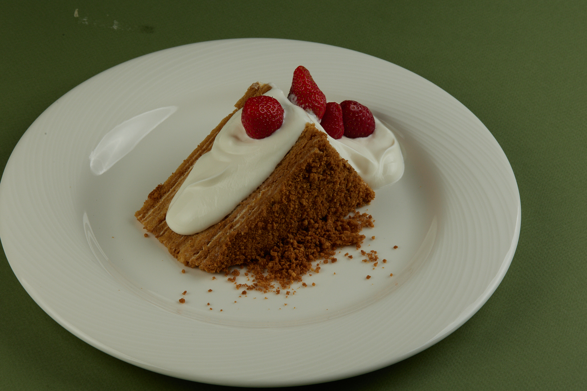

## Рецепт медовика 

## Набор ингредиентов 
 *__Для крема__*
* Сметана 20% **1100 гр** 
* Сливки 33% **400 гр**
* Сыр творожный **400 гр**
* Мёд **50 гр**
* Сахар **150 гр**
* Ванильный сахар **50 гр**

 *__Для коржей__*
* Мёд **50 гр**
* Сахар **350 гр**
* Сода **15 гр**
* Уксус столовый 9% **10 гр**
* Яйцо куриное **3 шт**
* Мука пшеничная **720 гр**
* Масло сливочное **200 гр**
## Технология приготовления коржей
Смешиваем яйцо, сахар, добавляем мёд, соду (гашеную уксусом), сливочное масло. 
Растапливаем всё в сотейнике до однородной консистенции на небольшом нагреве, постоянно помешивая. 
Даём немного остыть, перекладываем в дежу и замешиваем тесто. даем отдохнуть в холодильнике.
Делим коржи на равыное количество и раскатываем между двумя селиконовыми ковриками. Выпекать в разогретом пароконвектомате при температуре t-180С 4 - 5 минут до золотистого цвета.

## Технолоия приготовления крема
Подготовленные ингредиенты, соединяем в деже и начинаем взбивать на средней скорости. Накрываем в контакт плёнкой и убираем в холодильник для стабилизации.
## Технология сборки торта
Подготовленные коржи смазываем кремом по 150 гр, чередуя корж и крем. Последний слой крема засыпать крошкой из коржа.

## Инструменты
1. Планетарный миксер
2. Селиконовая лопатка
3. Сотейник 
4. Селиконовый коврик
5. Противни
6. Пароконвектомат или печь
7. Весы

Это оригинальный рецепт